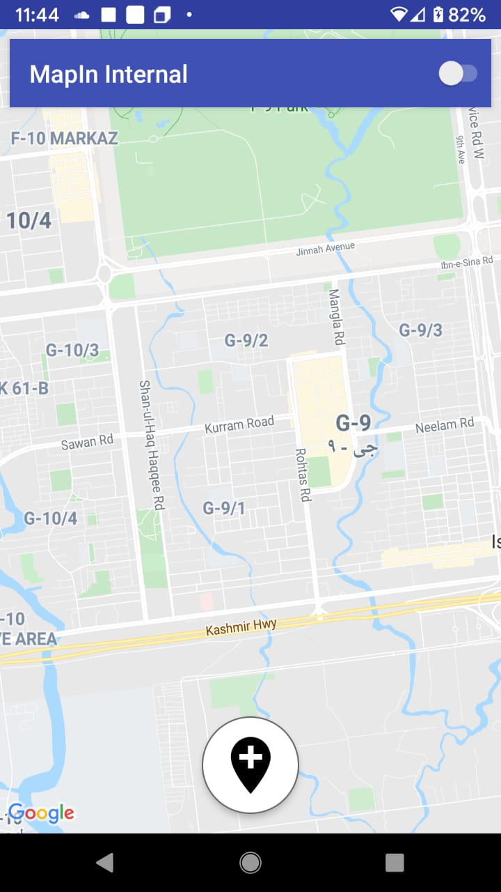

# MapIn Internal

This application serves as an application for internal needs of mapin. It basically collects the sensor data mainly magnetometer and wifi strength and sends it to the server in real time. The application also include inertial navigation component which when given the intial position starts to detect next user location using haversine formula.

##### Notes
The application requires tweakings before running.

##### Screenshots

##### Extras
The application is deprecated. 

##### License

